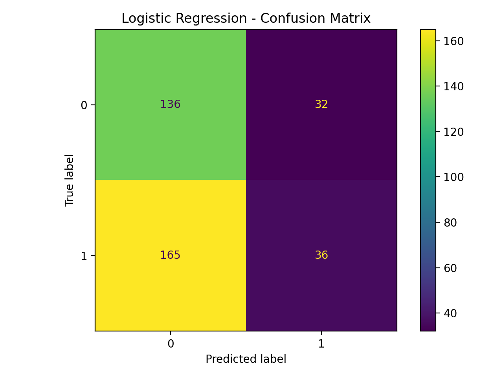
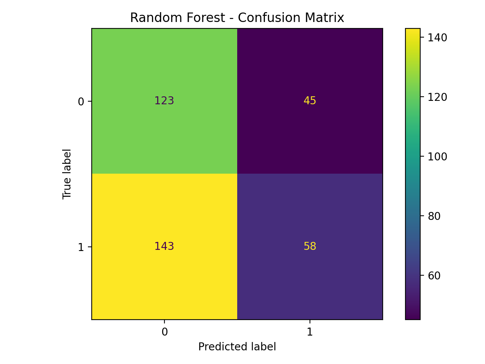
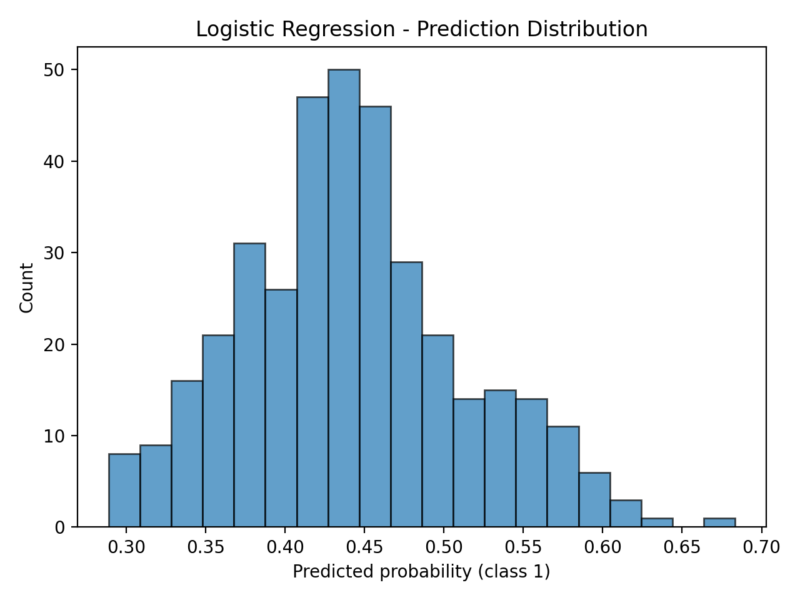
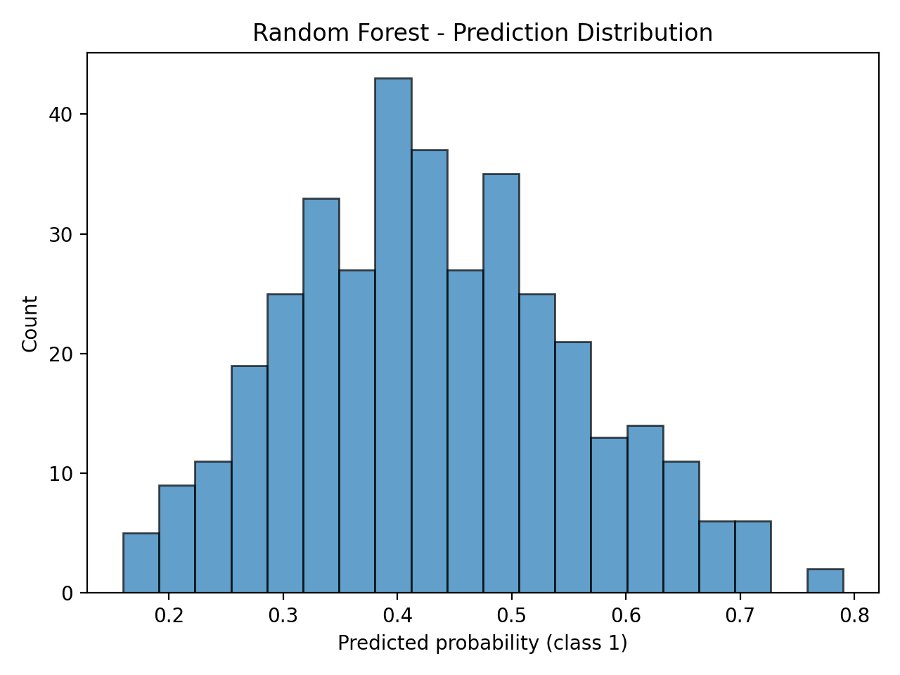
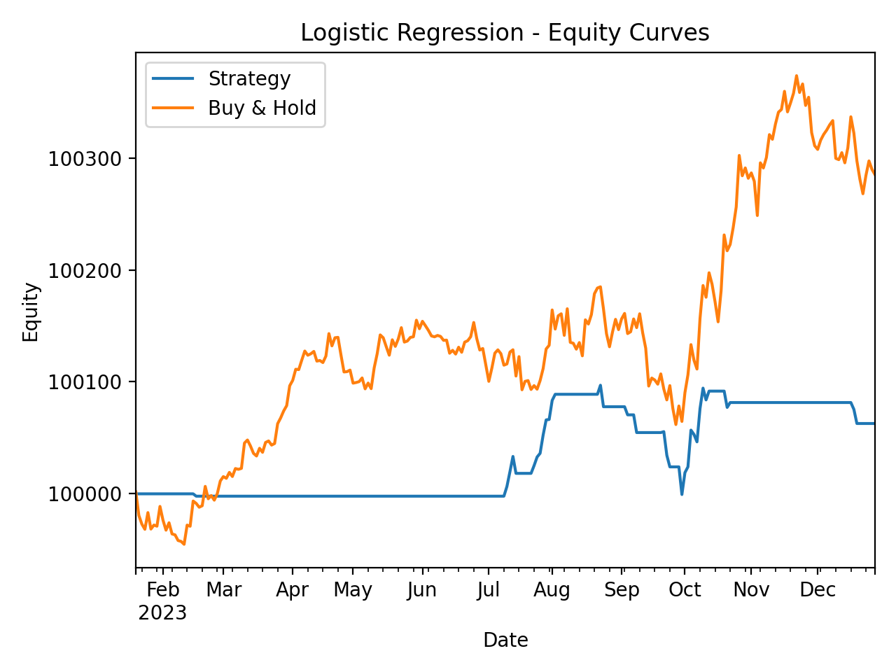
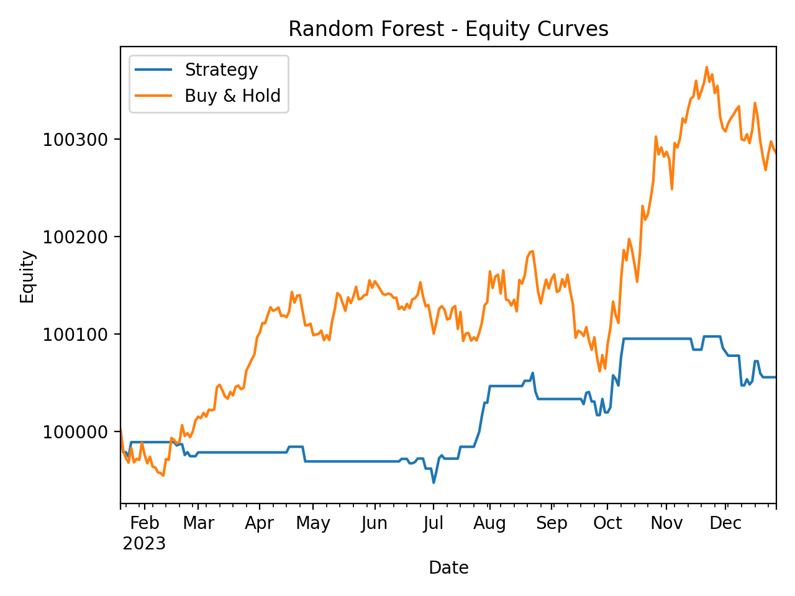
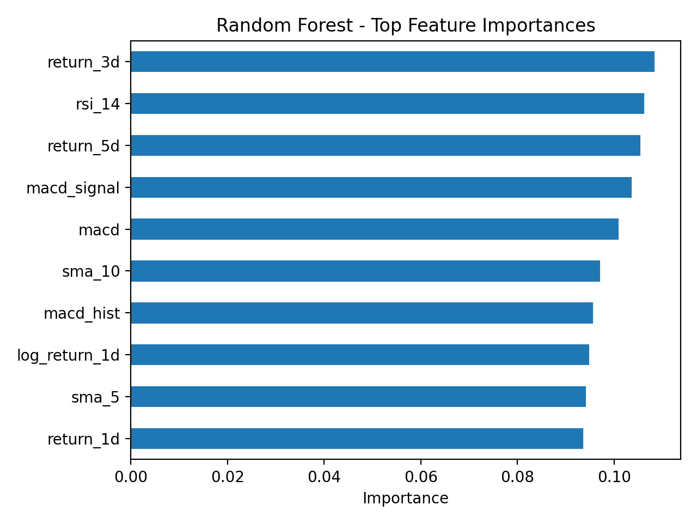

# Model and Strategy Comparison

## Metric & Performance Summary

| Model | Accuracy | Precision | Recall | MSE | R² | CV Accuracy | Final Strategy Equity | Final Buy & Hold Equity |
|-------|----------|-----------|--------|-----|----|-------------|------------------------|-------------------------|
| Logistic Regression | 0.466 | 0.529 | 0.179 | 0.2657 | -0.071 | 0.528 | 100,062.80 | 100,285.04 |
| Random Forest | 0.491 | 0.563 | 0.289 | 0.2723 | -0.098 | 0.510 | 100,055.76 | 100,285.04 |

## Visualizations

### Confusion Matrices

### Prediction Distributions

### Equity Curves

### Feature Importance (Random Forest)

## Discussion

### Which Model Performed Best?

- **By financial performance (final strategy equity)**, `Logistic Regression` performed best.

- **By predictive accuracy**, `Random Forest` achieved the highest accuracy of 0.491.

### Which Features Were Most Predictive?

Based on the Random Forest feature importances, the top predictive features were:

- `return_3d` (importance ≈ 0.108)
- `rsi_14` (importance ≈ 0.106)
- `return_5d` (importance ≈ 0.105)
- `macd_signal` (importance ≈ 0.104)
- `macd` (importance ≈ 0.101)

### Limitations of ML in Financial Forecasting

- **Non-stationarity**: Market relationships change over time. A model trained on historical data may degrade when regimes, volatility, or liquidity conditions change.

- **Overfitting risk**: With many features and limited history, models can fit noise rather than signal, leading to poor out-of-sample performance.

- **Ignoring transaction costs and market impact**: Our backtest assumes zero transaction costs and frictionless execution, which overstates real-world profitability.

- **Data leakage and alignment**: Care must be taken to ensure that only information available at time t is used to predict t+1. Using future data or misaligned labels can make performance look unrealistically good.

- **Simplified position sizing and risk management**: We assume fixed position sizes and ignore portfolio constraints, risk limits, and drawdown controls that practitioners must consider.
